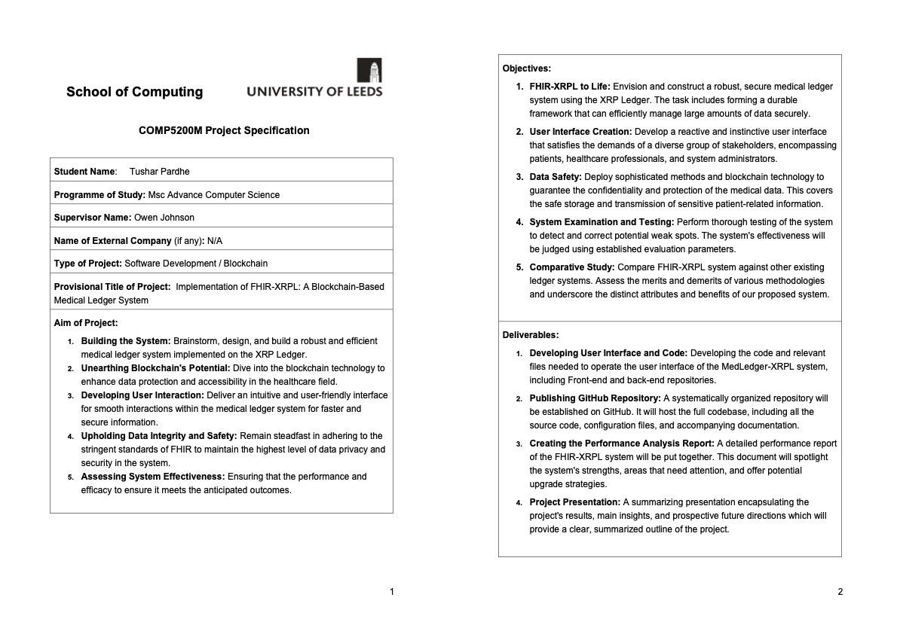
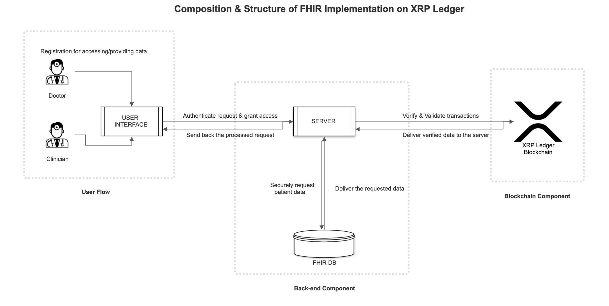
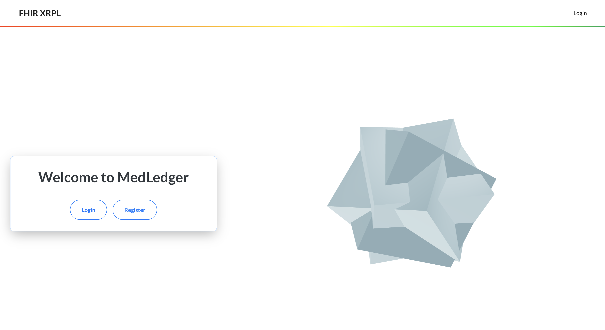
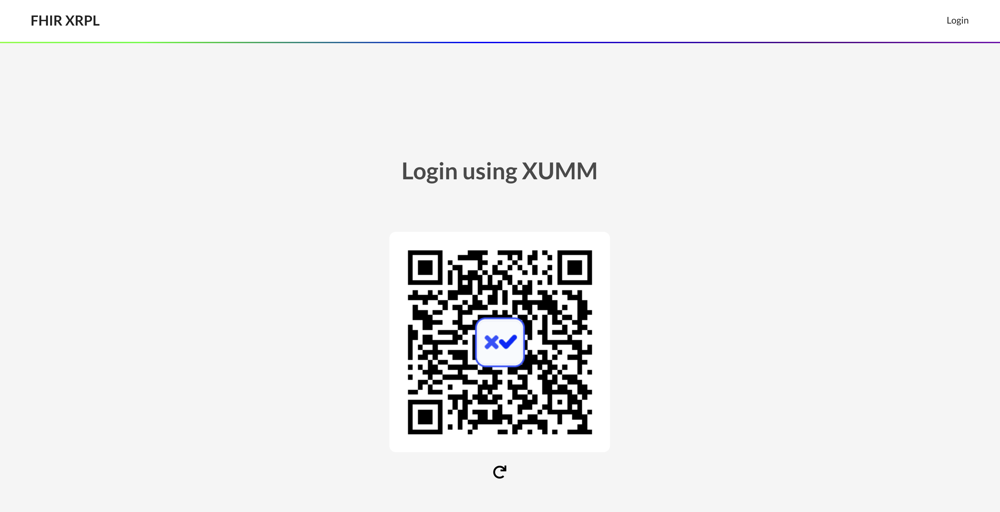
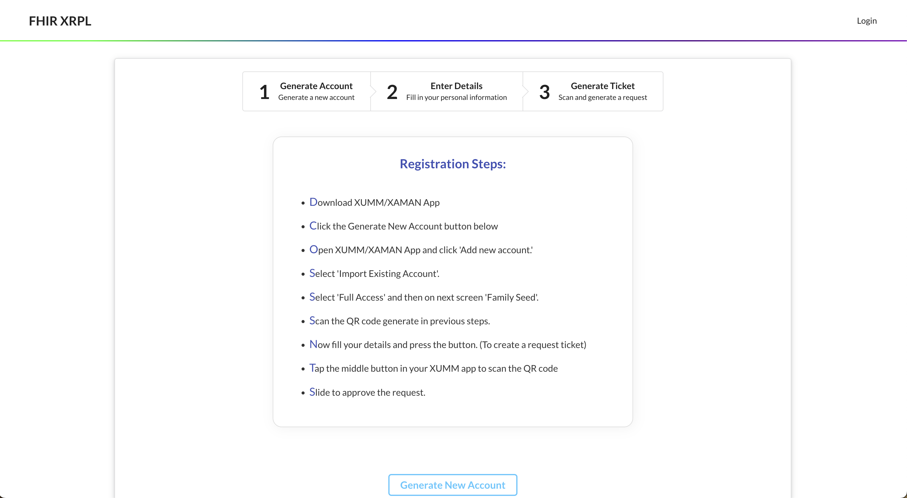
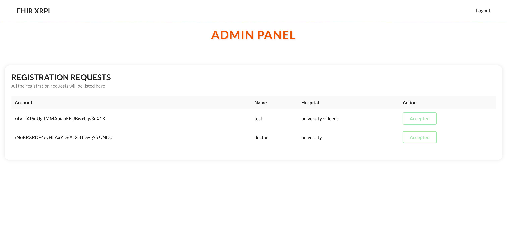

# 🏥 MedLedger XRPL - FHIR Implementation using XRPL

> 🎓 Collaboration: The project is currently undergoing active development under the guidance of professors from the University of Leeds, United Kingdom.

---
---
<br/>

## 📚 Table of Contents

- [🏥 MedLedger XRPL - FHIR Implementation using XRPL](#-medledger-xrpl---fhir-implementation-using-xrpl)
  - [📚 Table of Contents](#-table-of-contents)
  - [🎉 Introduction](#-introduction)
  - [🌟 Key Features](#-key-features)
  - [📽️ Project Specification](#️-project-specification)
  - [🖥️ System Design](#️-system-design)
  - [🍃 Architecture](#-architecture)
  - [💻 Technology Stack](#-technology-stack)
  - [📝 Detailed Implementation](#-detailed-implementation)
    - [👨‍💻 Frontend](#-frontend)
    - [⚙️ Backend](#️-backend)
  - [📄 License](#-license)

---
---
<br/>

## 🎉 Introduction

<div classname="intro-image">

</div>

<br/>

Welcome to MedLedger XRPL, a groundbreaking project that aims to revolutionize the healthcare industry by implementing Fast Healthcare Interoperability Resources (FHIR) using the XRP Ledger (XRPL) blockchain. Our mission is to provide a secure, efficient, and seamless platform for the exchange of healthcare information, thereby setting an unprecedented standard in the healthcare domain.

The project is currently under active development in collaboration with the University of Leeds, United Kingdom. The back-end repository can be found 

---
---
<br/>

## 🌟 Key Features

Our solution offers an array of salient features:

-   **Secure Data Exchange**: Capitalizing on the robust security mechanisms of the XRPL blockchain, we ensure a highly secure platform for healthcare data exchange. All data is encrypted utilizing state-of-the-art cryptographic algorithms, restricting access to authorized individuals only.

-   **Interoperability**: By incorporating FHIR standards, we facilitate seamless data interchange between disparate healthcare systems, contributing to a more efficient and collaborative healthcare ecosystem.

-   **Data Integrity**: Utilizing the inherent immutability of blockchain technology, we assure the veracity and integrity of the stored data, providing a reliable source of truth.

-   **Patient Privacy**: We prioritize patient confidentiality. Blockchain technology ensures that patient data remains private, with access restricted to authorized entities, thereby enhancing trust in our system.

---
---
<br/>

## 📽️ Project Specification



The above specification provides a detailed overview of our project, including the problem statement, objectives, and scope. It also outlines the key features and the target audience of our solution. View the PDF version of the specification .


---
---
<br/>

## 🖥️ System Design

The application comprises two main components:

-   **Frontend**: Developed using React, the frontend offers a user-centric interface for interaction. It communicates with the backend via an API and integrates with the XRPL for blockchain-specific transactions.

-   **Backend**: Implemented using Node.js and Express.js, the backend serves as a server that handles API requests, processes them, and provides the relevant responses. It also interacts with the XRPL for blockchain operations.

These components operate independently, communicating via the network, promoting scalability and maintainability.

---
---
<br/>

## 🍃 Architecture



The application aligns with FHIR standards, ensuring healthcare data is structured and standardized for easy exchange between different systems. It integrates with the XRPL, enabling secure and decentralized storage and management of healthcare data. The following diagram illustrates the architecture of our system:

---
---
<br/>

## 💻 Technology Stack

Our project employs a robust technology stack:

-   **Frontend**: We use React for creating interactive user interfaces, augmented by CSS for styling and layout.

-   **Backend**: The backend, built using Node.js and Express.js, provides a flexible server environment.

-   **Blockchain**: We integrate the XRP Ledger (XRPL), a decentralized cryptographic ledger, for secure data storage.

-   **Healthcare Data Standard**: The application leverages FHIR, an internationally recognized standard for healthcare data exchange.

-   **Build Tools**: The project uses Vite, Yarn, ESLint, and Prettier for building, package management, and code formatting and linting respectively.

Certainly, we can expand the description to include the specifics of your frontend routes and backend API endpoints:

---
---
<br/>

## 📝 Detailed Implementation

The application adheres to FHIR standards to ensure healthcare data is structured and standardized, facilitating easy data exchange between disparate systems. Moreover, it integrates with the XRPL to provide a secure and decentralized mechanism for healthcare data management.

The following key aspects are covered in our detailed implementation:

---
<br/>

### 👨‍💻 Frontend

The frontend, crafted using React, presents a user-centric interface for seamless interaction. It utilizes several routes to guide user navigation throughout the application:



-   **Landing Page** (`/`): The landing page serves as the entry point for our application. It presents a broad overview of our service and its features.



-   **Login Page** (`/login`): This page is dedicated to returning users. They can enter their credentials here to access their accounts.



-   **Registration Page** (`/registration`): New users can navigate to this page to register themselves in our system. The page includes a form where users provide necessary information to create a new account.



-   **Admin Panel** (`/admin-panel`): The admin panel provides a dashboard for administrators. This page presents a comprehensive view of the system and its elements, allowing administrators to manage users and data efficiently.

Each route points to a specific React element that handles the rendering of respective pages.

---
<br/>

### ⚙️ Backend

The backend, implemented with Node.js and Express.js, serves as a server processing API requests and returning the relevant responses. The backend API consists of the following endpoints:

-   **Generate QR** (`POST /generateQR`): This endpoint generates a QR code for a given request. The QR code is used for authentication purposes and facilitates secure login.

    **Request Body**:

    ```json
    {
      "TransactionType": "string",
      "Account": "string",
      ...
    }
    ```

    **Success Response**:

    - **Condition**: If everything is OK and the user address exists.

    ```json
    {
      "error": "User Address Exists"
    }
    ```

    - **Condition**: If everything is OK and the user address does not exist.

    ```json
    {
      "uuid": "string",
      "next": {
        "always": "string",
        "no_push_msg_received": "string"
      },
      "refs": {
        "qr_png": "string",
        "qr_matrix": "string",
        "websocket_status": "string"
      },
      "pushed": "boolean"
    }
    ```

    **Error Response**:

    - **Condition**: If there was no request body.

    ```json
    {
      "error": "Bad Request"
    }
    ```

    - **Condition**: If there was an internal server error.

    ```json
    {
      "error": "Some Error Occured."
    }
    ```

-   **Sign-In** (`POST /signIn`): This endpoint validates user credentials and handles the login process. Upon successful validation, users gain access to their respective accounts. It checks if the user address exists in the XRPL Oracle Account NFT List and returns a JWT token along with the user type (Admin/User).

    **Request Body**:

    ```json
    {
      "userAddress": "string"
    }
    ```

    **Success Response**:

    - **Condition**: If everything is OK and the user address is the admin address.

    ```json
    {
      "token": "string",
      "type": "Admin"
    }
    ```

    - **Condition**: If everything is OK and the user address exists.

    ```json
    {
      "token": "string",
      "type": "User"
    }
    ```

    **Error Response**:

    - **Condition**: If the user address does not exist.

    ```json
    {
      "error": "User Address Does Not Exist"
    }
    ```

    - **Condition**: If there was an internal server error.

    ```json
    {
      "error": "Some error occurred"
    }
    ```

-   **Verify UUID** (`GET /verifyUUID`): This endpoint validates the user's unique identifier with the Xumm app. It fetches the payload status of a specific UUID from the Xumm platform and returns the response and meta data. It plays a crucial role in maintaining the integrity of user data and preventing unauthorized access.

    **Request Parameters**:

    ```json
    {
      "uuid": "string"
    }
    ```

    **Success Response**:

    ```json
    {
      "payload_uuidv4": "string",
      "exists": "boolean",
      "is_xapp": "boolean",
      "user_token": "boolean",
      "multisign": "boolean",
      "submit": "boolean",
      "destination": "string",
      "resolved_at": "string",
      "txid": "string",
      "txblob": "string",
      "payload": {
        "application_uuidv4": "string",
        "response": {
          "account": "string",
          "txjson": {
            "TransactionType": "string",
            "Account": "string",
            ...
          }
        },
        "custom_meta": {
          "identifier": "string",
          "blob": "string",
          "instruction": "string"
        }
      }
    }
    ```

    **Error Response**:

    - **Condition**: If there was no UUID in the request parameters.

    ```json
    {
      "error": "Some error occurred."
    }
    ```

    - **Condition**: If there was an internal server error.

    ```json
    {
      "error": "Some error occurred."
    }
    ```

The backend interacts with the XRPL for blockchain-specific operations, contributing to the system's overall security and efficiency. It uses the `xrpl` and `xumm-sdk` libraries for interacting with the XRPL and Xumm platform respectively.

This implementation aims to maintain adherence to clean code principles and follows the best architectural practices.

---
---
<br/>

## 📄 License

This project is licensed under the [MIT License](LICENSE). The license provides all the details regarding permissions, conditions, and disclaimers.

We hope this comprehensive guide provides a clear understanding of our project. We are open to collaborations and contributions. Feel free to reach out for any queries or suggestions using this email: tpardhe@gmail.com
